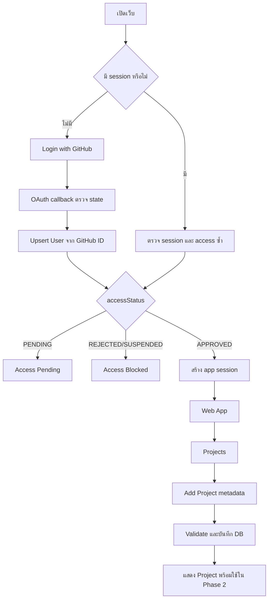

# Phase 1 — Foundation, Projects และ Admin/User Management

สถานะ: Implemented locally — เหลือเพียงใส่ GitHub OAuth credentials ของ deployment เพื่อทดสอบ OAuth จริง  
เป้าหมาย: สร้างโครงสร้างโปรเจคใหม่ให้พร้อมต่อยอด พร้อมระบบ GitHub-only login, ขอเข้าใช้งาน, admin จัดการ user/access request และการสร้าง Project metadata

## สิ่งที่มีอยู่ใน implementation ปัจจุบัน

| ส่วน | สถานะ |
| --- | --- |
| `apps/web` + `apps/api` boundary | ทำแล้ว |
| PostgreSQL + MikroORM initial migration | ทำแล้วและรันผ่าน local database |
| GitHub OAuth/session cookie | ทำแล้ว; ต้องกำหนด GitHub OAuth App ของ environment ก่อนทดสอบจริง |
| Access pending/blocked/request | ทำแล้ว |
| Admin user status/role management | ทำแล้ว |
| Admin access request approval/rejection | ทำแล้ว |
| Project metadata create/edit/archive | ทำแล้ว |
| Unit/typecheck/lint/build | ผ่านแล้ว |
| Hermes/Chat/Sandbox/GitHub App/Issues/PR | ตั้งใจไม่ทำใน Phase 1 |

## ผลลัพธ์ปลาย Phase

ผู้ใช้เปิดเว็บแล้ว login ด้วย GitHub เท่านั้น ระบบตรวจสิทธิ์จาก access status หากยังไม่ approved จะเข้าสู่หน้า Access Pending และส่งคำขอให้ admin ได้ เมื่อ admin อนุมัติ ผู้ใช้จะเข้าพื้นที่หลักและสร้าง project ได้

Admin เข้า `/admin` ด้วยสิทธิ์ของตนเอง เห็น users และ access requests ค้นหา/กรอง/ดูรายละเอียด อนุมัติ ปฏิเสธ ระงับผู้ใช้ เปลี่ยน role และ revoke sessions ได้ ทุก mutation ตรวจ policy ฝั่ง NestJS และบันทึก audit

Project ใน Phase 1 เป็นข้อมูลตั้งต้นเท่านั้น: repository URL, name, branch และ runtime metadata การกด Add Project ยังไม่ clone, ไม่สร้าง sandbox, ไม่เรียก Hermes, ไม่ install, ไม่ build และไม่สร้าง chat

## สิ่งที่ตัดออกจาก Phase 1

- Hermes agent catalog และ Hermes connection
- Chat และ conversation
- Sandbox, Docker workspace และ file explorer
- GitHub App installation/token broker
- Issues, Pre-Issues, Review และ Ultra Review
- Feature/Fix workflow และ Pull Requests
- Discord integration ทุกชนิด

Hermes และ Chat ย้ายไปเริ่มใน Phase 2 หลัง access, layout, project model และ authorization พร้อมแล้ว

## Workstreams

| Workstream | ผลลัพธ์ |
| --- | --- |
| A. Monorepo foundation | `apps/web`, `apps/api` รันและตรวจ type ได้ โดยมี admin area อยู่ใน web app |
| B. Database foundation | PostgreSQL, MikroORM entities/migrations, seed admin และ audit base |
| C. GitHub-only auth | OAuth callback, server session, logout, expiry และ user upsert |
| D. Access control | AccessRequest, pending/approved/rejected/suspended และ NestJS authorization |
| E. Admin user management | user table/detail, actions, role/status policy, audit history |
| F. Project management | project list, add/edit/archive metadata, validation และ permissions |
| G. Shared UI architecture | web/admin layouts, navigation, page header, table/detail patterns, error/loading states |
| H. Verification | unit/integration/browser checks และ fresh setup |

## Target structure

รายละเอียดเต็มอยู่ใน [structure.md](structure.md) โครง Phase 1 ที่ต้องสร้างคือ:

```text
project-forge/
├── apps/
│   ├── web/                         # Next.js user app + internal /admin
│   └── api/                         # NestJS API
├── infra/compose/
├── docs/
├── .requirements/
├── PROJECT_FORGE.plan
└── phase_1.md
```

`apps/worker` ยังไม่ต้องสร้างใน Phase 1 เพราะยังไม่มี Hermes/sandbox/background workflow แต่ phase roadmap จอง boundary ไว้ให้เพิ่มใน Phase 2 โดยไม่ย้าย domain หลัก

หน้าเว็บเรียก `apps/api` ผ่าน `apps/web/src/libs/api/` แบบเดียวกับแนวทาง API client ของ Pawpal Admin หน้าเว็บไม่เชื่อม database และไม่ import MikroORM entity

## User และ admin flow



## A. Monorepo foundation

### Todo

- [ ] สร้าง pnpm workspace และ Turbo pipeline
- [ ] สร้าง Next.js app เดียวใน `apps/web` และวาง `/admin` เป็น internal route area
- [ ] สร้าง NestJS app เป็น API กลาง
- [ ] วาง schemas/types/components ไว้ภายใน app ที่เป็นเจ้าของก่อน ไม่สร้าง `packages/shared` หรือ `packages/ui`
- [ ] ตั้ง TypeScript strict, ESLint, Prettier และ test commands
- [ ] เพิ่ม `.env.example` แยก web/admin/api และห้าม commit secret
- [ ] ตั้ง Docker Compose สำหรับ PostgreSQL และ Redis placeholder สำหรับ Phase 2
- [ ] เขียน root README สำหรับ setup/dev/test/migrate

ใช้ `pawpal` เป็น reference เรื่อง monorepo และแยก app/package ส่วน `apptech` เป็น reference เรื่อง Next App Router, page grouping, providers และ layout composition ห้ามเอา layout เดิมของ apptech มาผูกกับข้อมูล AppTech หรือ routes เดิมโดยตรง

## B. Database foundation

### Entities

```text
User
  id, githubUserId, githubLogin, name, avatarUrl
  role: ADMIN | USER
  accessStatus: PENDING | APPROVED | REJECTED | SUSPENDED
  isActive, createdAt, updatedAt

OAuthAccount
  userId, provider: GITHUB, providerAccountId
  accessTokenCiphertext, scope, expiresAt

Session
  userId, tokenHash, expiresAt, revokedAt, createdAt, lastSeenAt

AccessRequest
  id, userId, reason, status
  reviewedBy, reviewedAt, reviewNote, createdAt, updatedAt

AuditLog
  id, actorId, targetUserId, action, resourceType, resourceId
  beforeJson, afterJson, reason, requestId, createdAt

Project
  id, ownerId, name, githubUrl, githubOwner, githubRepo
  sourceBranch, targetBranch, nodeVersion, environmentJsonEncrypted
  status: ACTIVE | ARCHIVED, createdAt, updatedAt, archivedAt

ProjectMember
  projectId, userId, role: OWNER | CONTRIBUTOR | VIEWER
  createdAt, updatedAt
```

### Todo

- [ ] สร้าง MikroORM entities และ migration ownership ชุดเดียวใน `apps/api`
- [ ] เพิ่ม foreign keys และ unique `User.githubUserId`, `OAuthAccount(provider, providerAccountId)`
- [ ] เพิ่ม indexes สำหรับ access status, user search, project owner และ audit target/time
- [ ] สร้าง migrations สำหรับ fresh database และ upgrade database
- [ ] สร้าง seed admin จาก environment GitHub user ID หรือ one-time CLI โดยไม่ commit token
- [ ] สร้าง transaction helper สำหรับ admin actions
- [ ] เพิ่ม audit event ทุก user/project mutation

Project creation ไม่สร้าง file หรือ external side effect ใด ๆ ใช้ `githubUrl` เป็นข้อมูลที่ validate แล้วเท่านั้น ห้ามเก็บ GitHub token ใน Project table และห้ามส่ง environment secrets กลับ frontend

## C. GitHub-only authentication

### Flow

1. ผู้ใช้กด `Continue with GitHub`
2. API สร้าง OAuth state แบบสุ่มและผูกกับ transaction/session ที่หมดอายุ
3. GitHub callback ตรวจ state, code และ error
4. API แลก code กับ GitHub server-side
5. API เรียก GitHub user endpoint และใช้ immutable GitHub user ID เป็น identity
6. Upsert User/OAuthAccount
7. User ใหม่ได้รับ `PENDING` และสร้าง AccessRequest ครั้งเดียว
8. `APPROVED` จึงออก app session และ redirect `/`

### Todo

- [ ] ตั้ง GitHub OAuth App สำหรับ local/production callback แยกกัน
- [ ] implement start/callback ใน NestJS
- [ ] ตรวจ state, callback error, code reuse และ redirect allowlist
- [ ] encrypt OAuth token ด้วย server-side key หรือเก็บเฉพาะ token ที่จำเป็น
- [ ] สร้าง HttpOnly secure session cookie และ server session table
- [ ] implement logout, expiry, revoke และ session rotation
- [ ] เพิ่ม auth guard สำหรับ API และ layout guard สำหรับ web/admin
- [ ] ปิด login provider อื่นทั้งหมดใน Phase 1

## D. Access control และ Admin policy

### สถานะ

```text
PENDING -> APPROVED
PENDING -> REJECTED
APPROVED -> SUSPENDED
SUSPENDED -> APPROVED
```

Admin ต้องเป็น user ที่ `role=ADMIN` และ `isActive=true` ทุก admin action ต้องผ่าน API authorization ไม่ใช้ permission จาก navigation อย่างเดียว

### Admin actions

| Action | ผลลัพธ์ |
| --- | --- |
| Approve access | User เป็น APPROVED, request บันทึก reviewer/reason, audit ถูกสร้าง |
| Reject access | User เป็น REJECTED, request ปิดพร้อมเหตุผล |
| Suspend user | User เป็น SUSPENDED และ revoke active sessions |
| Reactivate user | User กลับ APPROVED หาก policy อนุญาต |
| Change role | เปลี่ยน USER/ADMIN พร้อมเหตุผลและ guard |
| Revoke sessions | session ของ user ถูก invalidate ทั้งหมด |
| View history | เห็น audit/security history ตามสิทธิ์ |

### Policy ที่ต้องบังคับ

- Admin ปิดใช้งานตัวเองไม่ได้
- ห้ามปิด admin คนสุดท้าย
- การเปลี่ยน role เป็น ADMIN ต้องบันทึกเหตุผล
- การ suspend ต้อง revoke session ภายใน transaction เดียวกันหรือมี recovery state ชัดเจน
- Admin เห็นเฉพาะ token metadata ไม่เห็น token จริง
- User ปกติจัดการ role/status ของ user อื่นไม่ได้

### Todo

- [ ] สร้าง `AccessPolicy`, `UserPolicy`, `AdminGuard` และ `PermissionGuard`
- [ ] สร้าง use cases แยก approve, reject, suspend, change role และ revoke sessions
- [ ] สร้าง audit service แบบ transaction-aware
- [ ] สร้าง admin routes และ page metadata แยกจาก user routes
- [ ] สร้าง table search/filter/pagination ด้วย server query
- [ ] สร้าง user detail tabs: Profile, Access, Sessions, Audit History
- [ ] แสดง empty/loading/error/confirm states ทุก mutation

## E. Admin UI structure ใน web app

```text
apps/web/src/app/admin/
├── layout.tsx
├── page.tsx
├── users/
│   ├── page.tsx
│   └── [userId]/
│       ├── page.tsx
│       ├── access/page.tsx
│       ├── sessions/page.tsx
│       └── audit-history/page.tsx
└── access-requests/
    ├── page.tsx
    └── [requestId]/page.tsx
```

นำ `apptech` มาใช้เป็น reference สำหรับ header, responsive sidebar, page header และ theme; นำ `pawpal` มาใช้สำหรับ user list/detail, permission navigation, filters, action menu และ history layout โดย admin อยู่ใน web app เดียวกัน

Admin sidebar รุ่นแรก:

```text
Overview
  Dashboard
Access
  Access Requests
Users
  All Users
  Administrators
Projects
  All Projects
Audit
  Audit Logs
```

เมนูกรองตาม permission ได้เพื่อ UX แต่ route/API ตรวจ permission ซ้ำเสมอ

## F. Projects management

### User pages

```text
apps/web/src/app/(main)/projects/page.tsx
apps/web/src/app/(main)/projects/new/page.tsx
apps/web/src/app/(main)/projects/[projectId]/page.tsx
```

### Add Project flow

1. User กด Add Project
2. กรอก GitHub repository URL หรือเลือกจาก list ถ้ามี integration พร้อม
3. กรอก Name optional; default จาก repository
4. เลือก source branch และ target branch; default จาก input
5. เลือก Node version เพื่อใช้ใน Phase 2
6. กรอก environment metadata/keys แบบ masked ถ้ามี; Phase 1 ยังไม่ materialize ลง sandbox
7. API validate, normalize URL/repo และตรวจ user มีสิทธิ์สร้าง project
8. บันทึก Project + ProjectMember OWNER
9. redirect project detail พร้อม status `ACTIVE`

### Todo

- [ ] สร้าง project list/card และ empty state
- [ ] สร้าง add project form ด้วย shared schema
- [ ] validate GitHub HTTPS URL และ normalize owner/repo
- [ ] ป้องกัน URL ที่มี credential, unsupported host และ malformed path
- [ ] สร้าง edit metadata form
- [ ] สร้าง archive project พร้อม confirm และ audit
- [ ] สร้าง project member table foundation แต่ยังไม่เปิด sharing เต็มรูปแบบ
- [ ] แสดงชัดว่า Phase 1 เป็น metadata-only และยังไม่มี sandbox

User สร้าง project ของตนเองได้ ผู้ใช้คนอื่นยังไม่เห็นจนกว่า project sharing ใน Phase 7 จะเปิดใช้งาน Admin เห็น project เพื่อ support/audit ตาม policy แต่ไม่ควรเข้าถึง secret/environment value

## G. API contract Phase 1

```text
GET  /api/v1/auth/me
GET  /api/v1/auth/github/start
GET  /api/v1/auth/github/callback
POST /api/v1/auth/logout

GET  /api/v1/access-requests/me
POST /api/v1/access-requests

GET  /api/v1/projects
POST /api/v1/projects
GET  /api/v1/projects/:projectId
PATCH /api/v1/projects/:projectId
POST /api/v1/projects/:projectId/archive

GET  /api/v1/admin/users
GET  /api/v1/admin/users/:userId
PATCH /api/v1/admin/users/:userId/status
PATCH /api/v1/admin/users/:userId/role
POST /api/v1/admin/users/:userId/revoke-sessions
GET  /api/v1/admin/users/:userId/audit-history
GET  /api/v1/admin/access-requests
POST /api/v1/admin/access-requests/:requestId/approve
POST /api/v1/admin/access-requests/:requestId/reject
GET  /api/v1/admin/audit-logs
```

ทุก mutation รับ `Idempotency-Key` เมื่อมีโอกาสกดซ้ำและคืน public error envelope ที่มี `code`, `message`, `requestId` และ `details` โดยไม่เปิด internal exception

## H. Todo ลำดับการทำงาน

### Iteration 1 — Foundation

- [ ] สร้าง monorepo apps/packages
- [ ] ตั้ง shared configs, UI tokens และ CI checks
- [ ] สร้าง Compose PostgreSQL
- [ ] สร้าง API health และ config validation
- [ ] สร้าง Next web/admin layouts จาก reference patterns

### Iteration 2 — Database/Auth

- [ ] MikroORM entities + migration
- [ ] GitHub OAuth
- [ ] session guard
- [ ] user upsert
- [ ] access request
- [ ] seed first admin

### Iteration 3 — Admin/User

- [ ] Admin shell, routes, navigation and permissions
- [ ] User list/search/filter/pagination
- [ ] User detail and status/role actions
- [ ] Access request approval/rejection
- [ ] Session revoke and audit history

### Iteration 4 — Projects

- [ ] Project schema/API
- [ ] Project list/empty state
- [ ] Add/edit/archive form
- [ ] URL/branch/runtime validation
- [ ] project audit
- [ ] browser E2E + migration/seed verification

## Acceptance criteria

### Authentication/access

- [ ] unauthenticated user เข้า `/` แล้วถูกส่งไป GitHub login
- [ ] login provider มี GitHub provider เดียว
- [ ] invalid OAuth state/code ถูกปฏิเสธ
- [ ] user ใหม่กลายเป็น PENDING และเข้า app ไม่ได้
- [ ] user ส่ง access request ซ้ำแล้วไม่เกิด duplicate
- [ ] admin approve แล้ว refresh สามารถเข้า user app ได้
- [ ] reject/suspend ได้ 403 และ revoke session ตาม policy

### Admin user management

- [ ] admin เห็น user list แบบค้นหา/กรอง/pagination
- [ ] admin เปิด user detail และ audit history ได้
- [ ] admin approve/reject/suspend/reactivate/change role ได้ตาม permission
- [ ] admin ปิดตัวเองไม่ได้
- [ ] admin คนสุดท้ายถูกปิดไม่ได้
- [ ] ทุก action มี audit actor/target/before/after/reason
- [ ] user ปกติเปิด admin URL/API แล้วไม่ได้ข้อมูล

### Projects

- [ ] approved user สร้าง project ได้
- [ ] project URL invalid/มี credential/unsupported host ถูกปฏิเสธ
- [ ] name optional แล้ว default ถูกสร้างจาก repository
- [ ] source/target branch และ Node version ถูกเก็บถูกต้อง
- [ ] refresh หน้า project แล้วยังเห็นข้อมูลจาก DB
- [ ] Add Project ไม่สร้าง sandbox ไม่ clone ไม่เรียก Hermes ไม่ install และไม่ build
- [ ] archive project มี confirm และ audit

### Structure

- [ ] `apps/web` และ `apps/api` มี boundary ชัด และ admin อยู่ใน protected web route
- [ ] Next layout ของ user/admin ไม่แชร์ session/provider ผิดพื้นที่
- [ ] NestJS เป็นเจ้าของ authorization และ database access
- [ ] fresh setup, migration, seed, typecheck และ test ผ่าน

## Definition of Done

- ระบบรันแบบ self-hosted ด้วย Next.js + NestJS + PostgreSQL ได้
- Login ใช้ GitHub เท่านั้นและใช้ immutable GitHub ID
- Access request และ admin user management ใช้งานจริง ไม่ใช่ซ่อนเมนูอย่างเดียว
- Project CRUD metadata ใช้งานได้และมี authorization/audit
- Layout และโครงสร้างแอพพร้อมต่อ Phase 2 โดยไม่ต้องย้าย User, Session, Project หรือ Audit schema
- มี static checks, unit tests, API integration tests และ browser tests ของ acceptance criteria
- เอกสาร setup และ `.env.example` ครบโดยไม่มี credential จริง
- ระบบเป็น private/internal และไม่มี public AI หรือ public project access
